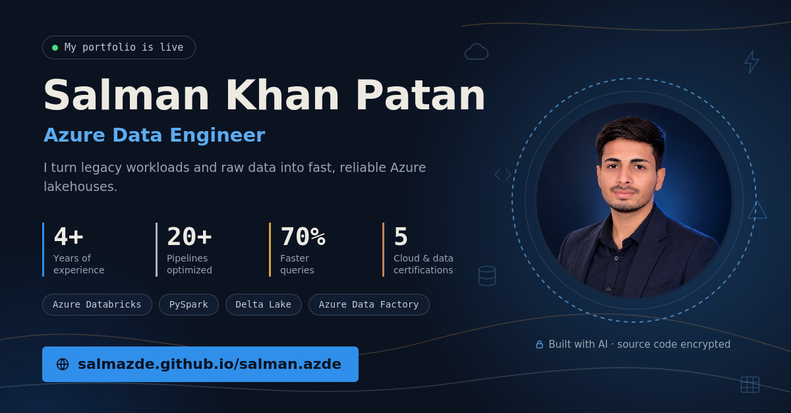

# Salman Khan Patan — Portfolio

🌐 **Live site:** [salmazde.github.io/salman.azde](https://salmazde.github.io/salman.azde/)

## About

This is the deployed build of my personal portfolio — Azure Data Engineer, 4+ years across Azure Data Factory, Databricks, PySpark, Delta Lake, and ADLS Gen2.

The site covers my experience, projects (including a [NYC Taxi medallion-architecture pipeline](https://github.com/salman-khan-216/NYC-Taxi-Project)), certifications, and core stack.

## About this repo

This repo is the **build output only** — an automated deploy target, not the source. The actual source (HTML/CSS/JS) lives in a private repo and is encrypted before anything lands here, so this repo intentionally contains no readable source code. It's rebuilt automatically on every update to the source.

## Tech

Azure Data Factory · Azure Databricks · PySpark · Delta Lake · ADLS Gen2 · Azure Synapse Analytics

## Contact

- 📧 [salmankhanazde@gmail.com](mailto:salmankhanazde@gmail.com)
- 💼 [LinkedIn](https://www.linkedin.com/in/salman-khan-p/)
- 🐙 [GitHub](https://github.com/salman-khan-216/)

Open to Azure Data Engineer roles — feel free to reach out.
